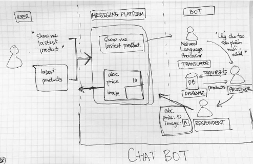
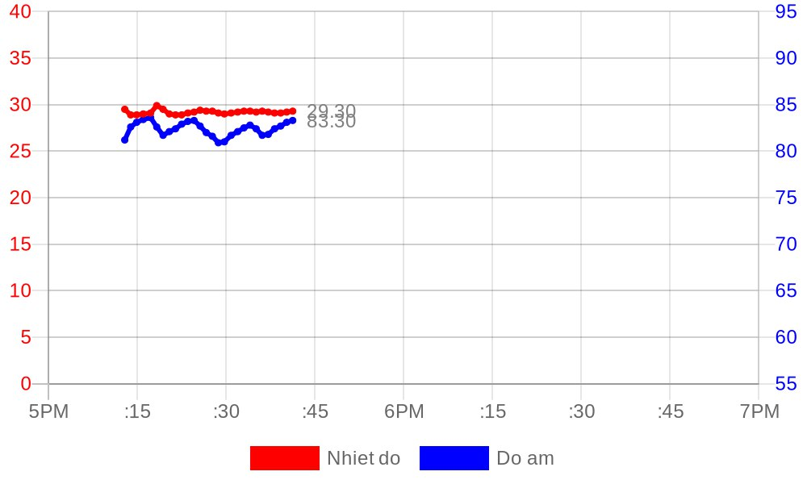
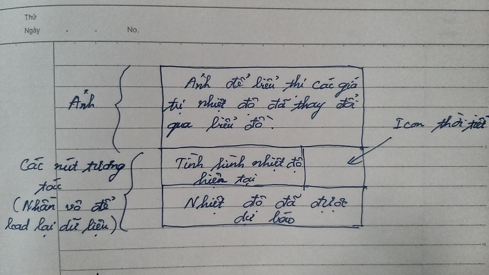
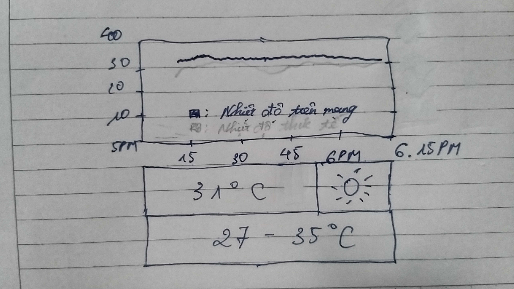

# Báo cáo công việc ngày 15/07/2024

# Đề tài được nhận:
Tên đề tài: " Nghiên cứu, thiết kế giao diện người dùng dựa trên Telegram Chat bot "

## Đã tìm hiểu được:

1. Cách hoạt động của telegram chat bot.

+ Theo em hiểu chatbot là một chương trình máy tính tương tác với người dùng bằng ngôn ngữ tự nhiên dưới một giao diện đơn giản, âm thanh hoặc dưới dạng tin nhắn.

+ Về cách hoạt động của chatbot có hình ảnh minh họa sau:

+ Chatbot tương tác với con người qua âm thanh hoặc văn bản và sử dụng các platform để giao tiếp với bot. 
   Phần mà các lập trình viên cần phát triển nằm toàn bộ ở phía sau bao gồm:
- Translator: Dịch yêu cầu của user, giúp máy tính hiểu được yêu cầu mình cần thực hiện → quyết định việc chatbot có thông minh hay không.
- Processor: Xử lý yêu cầu, thành phần này giúp khả năng của chatbot không bị giới hạn, máy tính làm được gì thì chatbot cũng làm được như vậy.
- Respondent: Nhận output và đóng gói gửi trả lại messenger platform, trả lại cho người dùng kết quả.

+ Em đã tìm hiểu code về Telegram chatbot qua: 

https://github.com/witnessmenow/Universal-Arduino-Telegram-Bot/

Trong link trên là về thư viện UniversalTelegramBot, thư viện này giúp cho người dùng việc khởi tạo bot của telegram dễ dàng hơn.

## Đã làm được:

1. Chạy được phần của anh Danh đã làm:

+ Phần của anh Danh đã làm là tạo giao diện từ telegram chat bot sử dụng để gửi và chỉnh sửa ảnh. 

+ Cụ thể: anh Danh khởi tạo một bot chat và tạo ra 3 loại hàm gửi ảnh, tạo ảnh và sửa ảnh. Trong đó:

Hàm tạo ảnh sẽ tạo một đường dẫn tới trang quickchart để thực hiện yêu cầu tạo ảnh.

Hàm gửi ảnh sẽ gửi ảnh đã tạo qua trang thức HTPT bằng cách nhận phản hồi từ telegram chat bot.

Hàm sửa ảnh sẽ sử dụng phương thức editMessageMedia cung cấp bởi API Telegram giúp sửa ảnh bot đã gửi.

2. Ý tưởng về đề tài:

Sau khi tìm hiểu về giao diện người dùng và telegram chatbot, em có ý tưởng là: 

Tạo ra một giao diện trên Telegram dựa theo hướng của anh Danh đã làm là gửi và chỉnh sửa ảnh, nhưng sẽ cải thiện bằng cách bổ sung thêm những phần tương tác nữa.

+ Theo ý tưởng của em, em sẽ tạo ra một giao diện dựa trên sơ đồ sau:

Với phần ảnh sẽ dựa theo phần anh Danh đã hòan thiện, và em dự tính thêm phần nhiệt độ ngoài trời vào thay cho phần độ ẩm.

Còn các nút bấm em sẽ sử dụng thư viện UniversalTelegramBot để khởi tạo thêm và liên kết được với phần trên, sao cho các nút bấm sẽ luôn ở bên dưới ảnh.

+ Ví dụ minh họa giao diện dựa theo ý tưởng:

## Công việc tiếp theo:

+ Em xin ý kiến từ phía thầy ạ.
