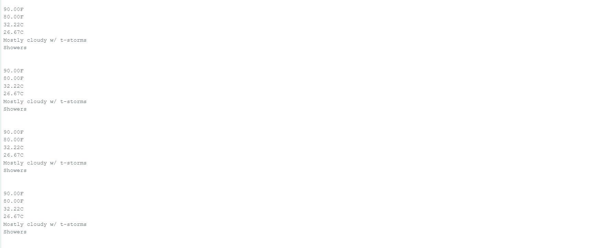

# Báo cáo công việc ngày 15/07/2024

# Chủ đề:  Nghiên cứu, thiết kế giao diện người dùng dựa trên Telegram Chat bot

## Đã tìm hiểu được:

1. Cách hoạt động của telegram chat bot và cách vận hành của hệ thống

+ Telegram chatbot là một chương trình tương tác với người dùng thông qua giao diện telagram.

Ảnh minh họa cách hoạt động:


+ Telegram chatbot có thể vận hành qua mã api bằng lập trình nhúng.

+ Link code tìm hiểu về lập trình nhúng Telegram chatbot: 

https://github.com/witnessmenow/Universal-Arduino-Telegram-Bot/

2. Cách vận hành cơ bản của API:

+ API là giao diện lập trình ứng dụng, có thể sử dụng nó để truy xuất đến một tập hàm đang dùng và trao đổi dữ liệu giữa các ứng dụng.

3. Hướng triển khai đề tài:

+ Sử dụng Esp32 để người dùng truy xuất dữ liệu cần thiết với API của web và kiểm soát phần cứng.

## Đã làm được:

1. Chạy được phần của anh Danh đã làm:


2. Ý tưởng về đề tài:

+ Sử dụng Esp32, dht22 và đèn led để làm đề tài:

Cụ thể: Esp32 sẽ lấy dữ liệu từ dht22 và dữ liệu thời tiết trên web để so sánh, sau đó xử lý ra kết quả để điều khiển đèn led cảnh báo.

+ Esp32 lấy dữ liệu từ dht22 đã tìm hiểu qua anh Danh.

+ Esp32 lấy dữ liệu trên trang web:

link tham khảo: https://youtu.be/tD66nwc7-dI?si=_15g3h6ua2dzt9et

Đã thay đổi đoạn code sau để phù hợp với đề tài.

Code mẫu:

```
void filter(){
  DynamicJsonBuffer jsonBuffer(AW_line.length() + 1);
  JsonObject & root = jsonBuffer.parseObject(txt);
  float temp_max = root["DailyForecasts"] [0] ["Temperature"] ["Maximum"] ["Value"];
  float temp_min = root["DailyForecasts"] [0] ["Temperature"] ["Minimum"] ["Value"];
  String wea= root["DailyForecasts"] [0] ["Day"] ["IconPhrase"];
```

Code điều chỉnh:

```
void filter(){
  JsonDocument doc;
  AW_line.toCharArray(txt, AW_line.length() + 1);
  deserializeJson(doc, txt);
  float temp_max_1 = doc["DailyForecasts"] [0] ["Temperature"] ["Maximum"] ["Value"];
  float temp_min_1 = doc["DailyForecasts"] [0] ["Temperature"] ["Minimum"] ["Value"];
  String weather_day = doc["DailyForecasts"] [0] ["Day"] ["IconPhrase"];
  String weather_night = doc["DailyForecasts"] [0] ["Night"] ["IconPhrase"];
```

+ Kết quả sau khi điều chỉnh và chạy thử:



## Công việc tiếp theo:

+ Cho em xin ý kiến từ thầy ạ.