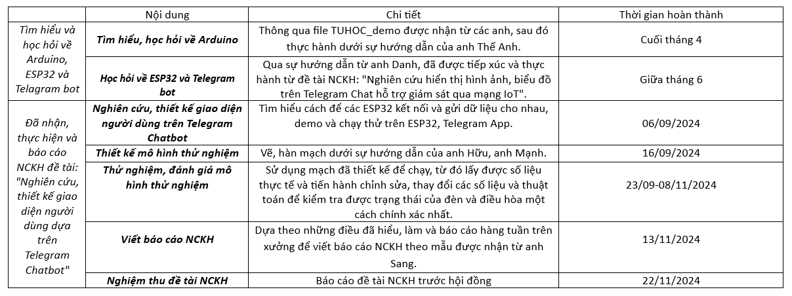

# Tổng kết năm 2024-Ngày tổng kết: 18/01/2025.

# Nội dung đã thực hiện trong năm:

1. Tìm hiểu và học hỏi về Arduino, ESP32 và Telagram bot.

2. Đã nhận, thực hiện và báo cáo NCKH đề tài: "Nghiên cứu, thiết kế giao diện người dùng dựa trên Telegram Chatbot".

3. Nhận chuyển giao "Dự án Hinori" từ anh Thế Anh.

# Tóm tắt chi tiết quá trình thực hiện trong năm:

- Sau khi nghiệm thu là bắt đầu đến thời gian thi nên em tập trung vào việc ôn thi.

- Trong quá trình ôn thi, thầy Hiếu có bảo em tiếp tục lấy dữ liệu. 
Do vậy, hôm 28/12/2024 em tiếp tục lấy dữ liệu nhiệt độ, độ ẩm, ánh sáng tại phòng em và ngoài ban công cho đến nay.

- Sau khi nhận chuyển giao đề tài từ anh Thế Anh, thầy Hiếu yêu cầu anh làm nốt cho hết phần điện 1 pha.
Nên hiện tại em vẫn chỉ đang dừng ở mức học hỏi, chưa có phụ trách chính về phần này.

# Định hướng phát triển đề tài:

Với tiêu chí phát triển đề tài để sau này có thể trở thành sản phẩm bán được, em định hướng đề tài của mình có thể phát triển như sau:

1. Giải pháp điều khiển các thiết bị từ xa sử dụng Telegram Chatbot. 

- Trạng thái: Đã tìm hiểu được và có ý tưởng (Bằng cách sử dụng cảm biến hồng ngoại, Led và ESP32).

- Lý do thêm: Có thể tích hợp thêm đề tài NCKH em đã làm để tự động tắt từ xa nếu người dùng quên tắt hoặc bằng cách hẹn giờ.

Trên thị trường hiện tại tuy có người đã làm được, nhưng mỗi thiết bị của họ chỉ ứng dụng cho 1 thiết bị thông minh trong nhà nhất định.

2. Ứng dụng Telegram Chatbot để lưu trữ và điều chỉnh các dữ liệu lưu trong mạch.

- Trạng thái: Đã tìm hiểu được và có ý tưởng (Bằng cách sử dụng thẻ nhớ, ESP32).

- Lý do thêm: Có thể sử dụng để lưu trữ, thay đổi dữ liệu trong thẻ nhớ để từ đó điều khiển được ESP32 từ trên Telegram mà không cần nạp lại code. 

3. Ứng dụng các giao thức trên ESP32 để đặt mật khẩu và tên mạng Wifi.

- Trạng thái: Chưa tìm hiểu.

- Lý do thêm: Để chạy được các chương trình đã nêu thì cần ESP32 kết nối được Wifi, mà Wifi mỗi nơi khác nhau nên cần một chương trình để giúp ESP32 nhận được Wifi.

4. Thiết lập, nhận diện giọng nói người dùng và điều khiển thiết bị.

- Trạng thái: Đã tìm hiểu sơ qua về cách hoạt động, nhưng chưa chắc chắn.

- Lý do thêm: Không phải lúc nào cũng sẽ có Wifi để sử dụng, có lúc thiết bị mạng bị mất kết nối Wifi thì vẫn có thể sử dụng chức năng nhận diện giọng nói để dùng tạm.

Các đề tài trên được em tự định hướng bởi sau một thời gian tìm hiểu về thị trường và dựa theo cảm quan cá nhân của mình,
em thấy đề tài của mình khá phù hợp với hướng phát triển tạo một sản phẩm có thể bán được, giúp cho ngôi nhà trở nên bán tự động, có thể điều khiển từ xa.

# Dự định tiếp theo:

- Thầy cho em xin thêm ý kiến ạ.